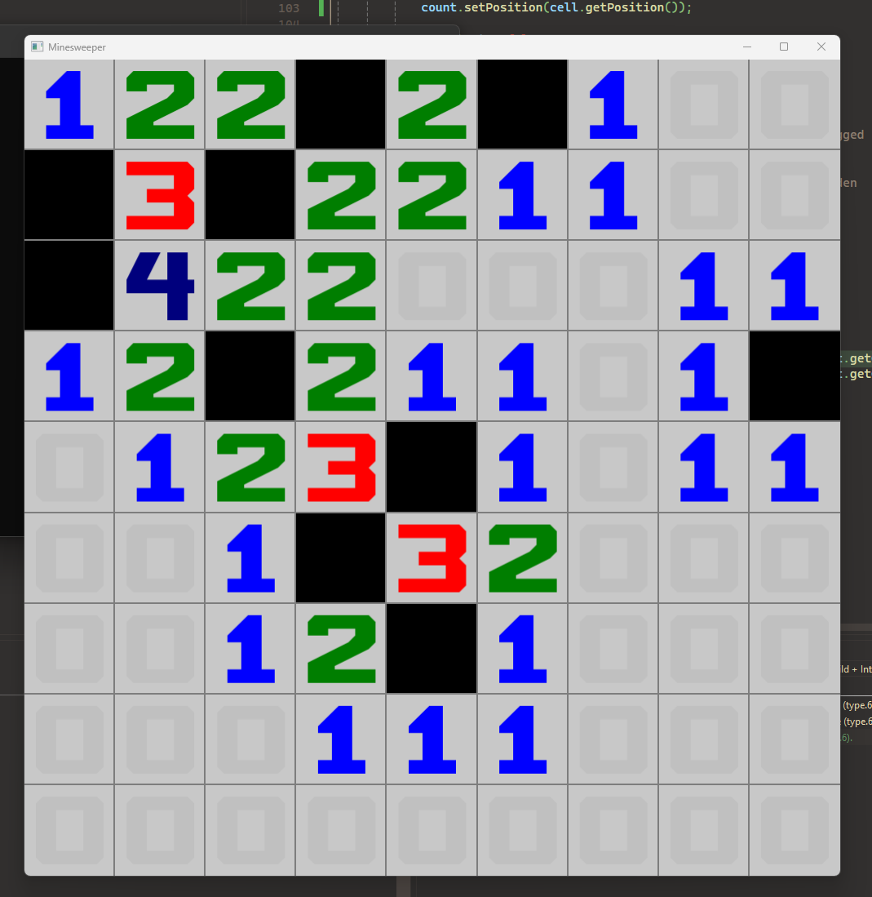

# Snake_C++_SFML
Simple minesweeper in about 2 hours written in C++ using SFML for rendering

Video of me writing it from scratch: 

Pt1: https://www.youtube.com/watch?v=qivdZd3Ys_o

Pt2: https://www.youtube.com/watch?v=-8oZf6qW2m8

